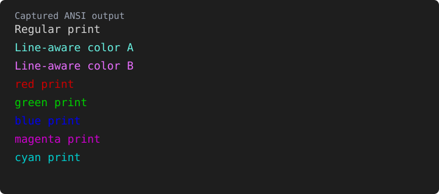

# vizible

Minimal, deterministic color-coded debugging for Python.

`vizible` provides a way to track execution flow by assigning a deterministic
color to each `dprint` call site.

## Features

- **`dprint(*args)`**: Prints text in a truecolor RGB value derived from the calling file name and line number. The value is stable while that call site stays at the same path and line.
- **Classic ANSI Colors**: Quick access to `red`, `green`, `blue`, `magenta`, and `cyan`.
- **Zero Configuration**: Works out of the box in most modern terminals.

## Usage

```python
from vizible import dprint, red, green

# Each call site gets a deterministic color
dprint("This is always the same blue-ish color")
dprint("This is always the same orange-ish color")

# High-contrast status helpers
red("Something went wrong")
green("Process complete")
```

## Example Output



This is a generated rendering of the ANSI stream emitted by the example, not a
live terminal. The two `dprint` lines preserve their exact emitted RGB values.
The named helpers emit standard ANSI SGR color codes (`31`, `32`, and so on),
so their final RGB values deliberately follow your terminal's palette; the
preview uses the xterm default palette for those lines.

## Why?

When debugging loops or long log streams, visual pattern matching is faster than reading text. `vizible` allows you to "see" where your logs are coming from without reading file/line prefixes.
